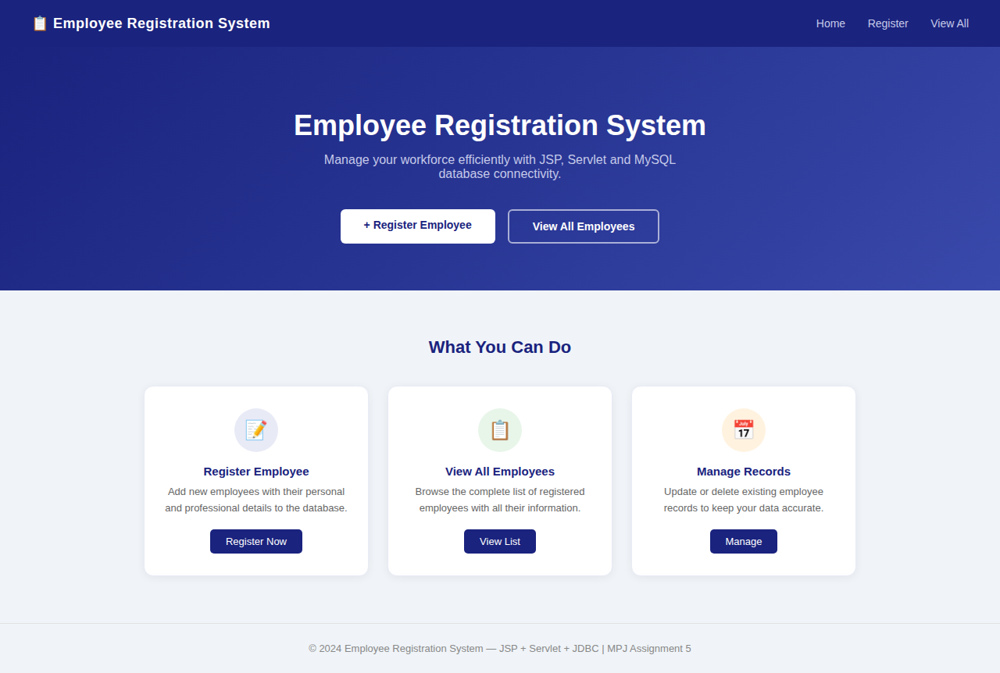
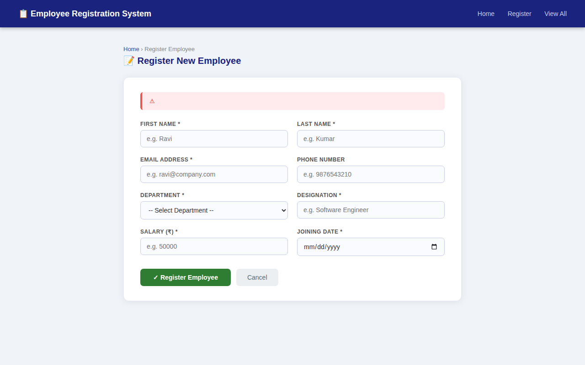
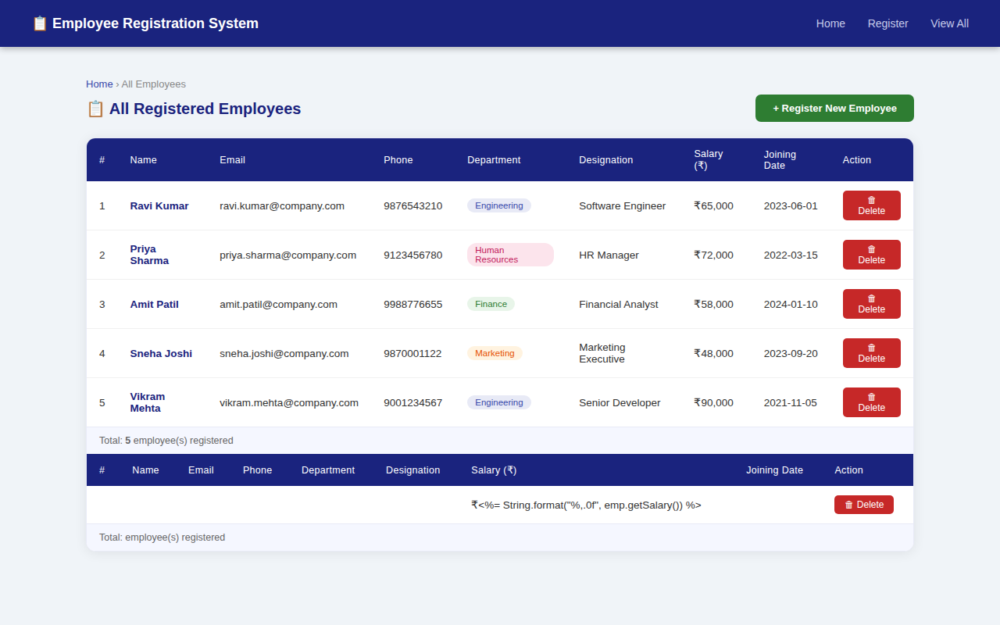
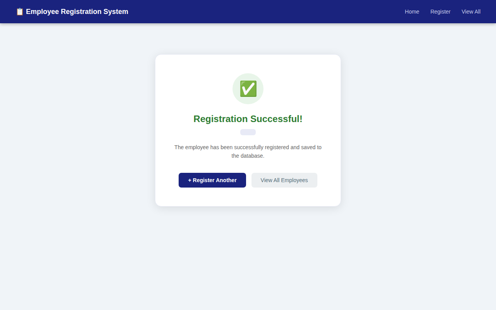

# MPJ Assignment 5 — Employee Registration System

A web application for Employee Registration built using **JSP**, **Servlet**, and **JDBC (MySQL)**.

---

## Screenshots

### Home Page


### Registration Form


### Employee List


### Success Page


---

## Project Structure

```
EmployeeRegistration/
├── src/
│   └── com/emp/
│       ├── DBConnection.java       ← MySQL JDBC connection
│       ├── Employee.java           ← Model / Bean class
│       ├── EmployeeDAO.java        ← Database operations (CRUD)
│       └── EmployeeServlet.java    ← Main Servlet controller
│
├── WebContent/
│   ├── WEB-INF/
│   │   ├── lib/
│   │   │   └── mysql-connector-java-8.0.13.jar
│   │   └── web.xml                 ← Servlet mapping
│   ├── index.jsp                   ← Home / Landing page
│   ├── register.jsp                ← Employee registration form
│   ├── success.jsp                 ← Success confirmation page
│   └── employeeList.jsp            ← View all employees table
│
├── screenshots/                    ← App preview images
└── database_setup.sql              ← MySQL database script
```

---

## Platform & Tools

| Tool | Version |
|---|---|
| JSP | 2.2+ |
| IDE | Eclipse / STS |
| JDK | 1.8 or later |
| Apache Tomcat | 8.5 |
| Servlet API | 2.5 |
| MySQL Connector | mysql-connector-java-8.0.13.jar |

---

## Setup Instructions

### Step 1 — Database
```bash
mysql -u root -p < database_setup.sql
```

### Step 2 — Configure DB Password
Open `src/com/emp/DBConnection.java` and set:
```java
private static final String PASSWORD = "your_mysql_password";
```

### Step 3 — Import into Eclipse
1. File → Import → Existing Projects into Workspace
2. Add `mysql-connector-java-8.0.13.jar` to `WebContent/WEB-INF/lib/`
3. Right-click project → Build Path → Configure Build Path → Add the jar

### Step 4 — Run on Tomcat
1. Right-click project → Run As → Run on Server → Tomcat 8.5
2. Open: `http://localhost:8080/EmployeeRegistration/`

---

## Features
- Register new employees with full details
- View all employees in a sortable table
- Delete employee records
- Success confirmation page after registration
- Department color-coded badges
- Responsive, clean UI

---

## Objectives
- Understand server-side scripting with JSP and Servlet
- Learn JDBC database connectivity with MySQL
- Develop a complete web application using MVC pattern
